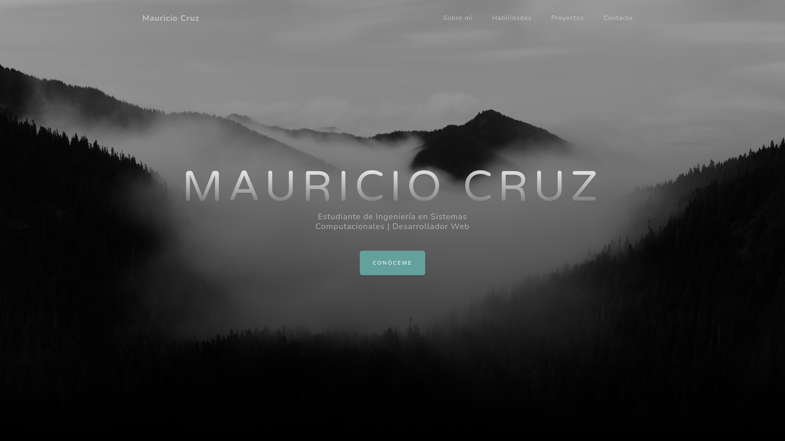

<div align="center">


<br>

# Instituto Tecnológico de Oaxaca

### portafolio-web

#### Portafolio personal responsivo basado en la plantilla Bootstrap 5: Grayscale

Cruz Bautista Mauricio Raciel  
Ingeniería en Sistemas Computacionales  
Programación Web, Verano 2026  

</div>

---

## Contenido

- [Descripción](#descripción)
- [Demo en vivo](#demo-en-vivo)
- [Características del portafolio](#características-del-portafolio)
- [Estructura del repositorio](#estructura-del-repositorio)
- [Proceso de creación](#proceso-de-creación)
- [Capturas de pantalla](#capturas-de-pantalla)
- [Tecnologías utilizadas](#tecnologías-utilizadas)
- [Autor](#autor)

---

## Descripción

**portafolio-web** es un sitio web personal estático y responsivo, estructurado de forma nativa en HTML5, CSS3 y JavaScript Vanilla.

El diseño está construido sobre el framework **Bootstrap v5.2.3**, tomando como base la plantilla comercial *Grayscale* de Start Bootstrap. Se omitió por completo el uso de frameworks de JavaScript complejos como React o Vue, priorizando el rendimiento, la manipulación directa del DOM y la correcta estructuración del layout adaptativo a través de clases utilitarias.

---

## Demo en vivo

El proyecto se encuentra completamente desplegado y funcionando de forma pública en GitHub Pages:

**[https://raciel7u7.github.io/portafolio-web/](https://raciel7u7.github.io/portafolio-web/)**

---

## Características del portafolio

El sistema está estructurado semánticamente en un documento único controlado mediante clases nativas de Bootstrap 5 y lógica personalizada en Vanilla JavaScript.

### Componentes y Secciones

| Sección | Componente Bootstrap | Funcionalidad e Impacto |
|---|---|---|
| **Navegación** | `.navbar-expand-lg` / `ScrollSpy` | Barra superior fija con comportamiento dinámico (`Navbar shrink`) que reduce su tamaño al hacer scroll y resalta de manera automática la sección activa en la pantalla. |
| **Inicio (Hero)** | `.masthead` / Flexbox | Zona de alto impacto visual con tipografías fluidas y fondos de alto contraste optimizados mediante gradientes superpuestos para una legibilidad impecable. |
| **Sobre mí** | `.about-section` / Grid | Presentación de la trayectoria académica del estudiante, metas profesionales e integración simétrica de una fotografía de perfil formal. |
| **Habilidades** | `.row-cols` / `.bg-black` | Grid responsivo de tarjetas interactivas que utiliza la librería tipográfica *Font Awesome* para categorizar el stack tecnológico del autor. |
| **Proyectos** | `.align-items-center` / Layout Alternado | Galería de desarrollo con maquetación asimétrica que expone las iniciativas, arquitecturas planteadas y herramientas estimadas para futuros proyectos. |
| **Contacto** | `.card` / Tarjetas de Accesos | Bloque interactivo con hipervínculos funcionales hacia el entorno de control de versiones y correo electrónico corporativo. |

---

## Estructura del repositorio

Para cumplir de forma estricta con los estándares de producción académica, todos los recursos esenciales de renderizado se han extraído de los directorios de compilación intermedios del template original y se han organizado de manera centralizada en la raíz del espacio de trabajo:

```text
portafolio-web/
├── index.html          
├── README.md          
├── LICENSE             
├── .gitignore          
├── css/
│   └── portafolio.css  
├── js/
│   └── portafolio.js 
└── assets/
    └──img
        └──bg-masthead.jpg
        └──bg-signup.jpg
        └──demo-image-01.jpg
        └──demo-image-02.jpg
        └──ipad.png
    └──foto-pefil.jepg
    └──proyecto-01.png
    └──proyecto-02.png
    └──proyecto-03.png
    └──favicon.ico
```
## Proceso de creación

El flujo de trabajo se ejecutó bajo los siguientes pasos:

1. **Análisis y Depuración de Dependencias:** Se descargaron los archivos del tema *Grayscale*. Se eliminaron todos los componentes redundantes y scripts de automatización pesados (archivos de configuración de npm, builders y carpetas intermedias de desarrollo) para asegurar un entorno de ejecución estático nativo y ligero.
2. **Reestructuración de Directorios a la Raíz:** Originalmente, la plantilla distribuía sus assets compilados de manera aislada. Se extrajeron de manera manual el archivo `index.html`, las hojas de estilo y los scripts hacia la raíz del repositorio local, manteniendo la cohesión organizativa exigida en la rúbrica de entrega de este trabajo en las subcarpetas `css/`, `js/` e `img/`.
3. **Corrección de Enlaces Cruzados e Inyección Semántica:** Se modificaron las rutas relativas dentro de las etiquetas `<link>`, `<script>` e `` del archivo `index.html` para apuntar a la nueva disposición estructural. Se sustituyeron los textos dummy por mi información real del perfil académico y stack tecnológico.
4. **Sincronización y Validación de Medios:** Se mapearon las extensiones internas de las imágenes en el documento HTML de `.jpg` a `.png`/`.jpeg` para acoplarlas exactamente a los recursos gráficos implementados. Se procesó mi fotografía de perfil aplicando máscaras circulares responsivas de Bootstrap (`.rounded-circle`) y un fondo corporativo difuminado.
5. **Alineación con ScrollSpy:** Se depuraron los selectores de los enlaces del menú y los identificadores de cada sección (`id=""`) en el cuerpo del documento para evitar saltos bruscos y garantizar transiciones de scroll suaves y fluidas.
6. **Despliegue Remoto:** Se inicializó el repositorio local con Git y activando el servidor web estático nativo mediante la rama principal en GitHub Pages.

---

## Capturas de pantalla

### Vista de Inicio (Hero)


---

## Tecnologías utilizadas

* **HTML5:** Para el marcado semántico de la aplicación.
* **CSS3:** Para personalizaciones de estilos layouts.
* **JavaScript (Vanilla):** Para el control dinámico de componentes UX.
* **Bootstrap v5.2.3:** Como framework base de diseño responsivo.
* **Font Awesome v6.3.0:** Para el renderizado del kit de iconos.
* **GitHub Pages:** Para el alojamiento y despliegue del entorno en vivo.

---

## Autor
Mauricio Cruz